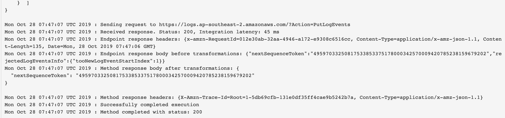
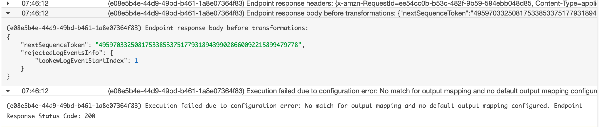

Last Thursday I was talking to a web developer friend of mine about the logging that I was testing. It involved a library that was able to send logs from the client side to the CloudWatch api. It was pretty nifty, however, I had some reservations about how secure the library was and the dangers of storing AWS credentials in our JavaScript client side code. These concerns were touched on by my friend.

Obviously, I followed Best Practice in creating IAM roles and only gave the role used by the credentials access to uploading logs to CloudWatch. I didn't want to give it __any__ more than that, who knows what nefarious activities a potential hacker could get up to. I thought it was relatively safe.

However, my friend brought up the risk of overloading the CloudWatch API with calls to upload logs. I didn't think of this. I don't really know what issues that could cause besides limiting the ability of the client to effectively log legitimate activity. However, it was enough of an issue to make me reconsider using the library I was testing. I was already unsure about storing creds in the client side and this just added to that concern.

I decided to setup an API Gateway endpoint integrated with CloudWatch. I've played around with API Gateway before, but only really using the Lambda integration. I didn't have to deal with much of the more finicky settings of the method or integration request and the method or integration response settings before. I was going into this with a superficial working knowledge of API Gateway and an ignorance as to what else would be required to get the integration working.

At first it was just about writing Terraform code to provision the API Gateway and the integration to CloudWatch. This was pretty straight forward. Next I had to figure out how to actually get it working. I drew some insight from the library I was using as it showed me what a call to the CloudWatch api requires. I did a bunch of googling which lead me to CloudWatch API docs, the API Gateway docs, and various other articles. These started to help me form an idea in my mind as to what I was meant to do.

These lead me to get a sense that what is required is the use of the mapping templates for the integration and method response. I didn't really understand why these were necessary. I just wanted to send some logs to CloudWatch. Why couldn't it just take it!? However, I came to realise that what the client is sending to the API Gateway end point may not conform to whatever it is integrated with. I found a Stack Overflow post that showed me this in action. It also gave me a start for a mapping template for the integration request. This was needed even if the request conformed exactly to what the CloudWatch integration needed.

I got it up and running and started to test the endpoint through Postman, but the logs I was getting gave me minimal information. I realised I had to change the logging level to `ERROR`. This gave me logs as detailed as those I was getting when I used the console method test. This helped __A LOT__. I was no longer flying blind in a sea of mist while blind folded.

I gradually learned how to use the [Velocity Templating Language](http://velocity.apache.org/engine/devel/vtl-reference.html#ifelseifelse-output-conditional-on-truth-of-statements) to map the request to the what the integration wanted. This was a bit finicky because I couldn't find an online compiler to test the code. I had to do that through the console method test functionality. A couple of things that tripped me up were the looping of the array containing the messages and the conditional statement for the `sequenceToken`.

The conditional statement wasn't clear to me, but through testing I was able to write some VTL that worked. It made sure to include the next sequence token for all logs besides the very first. This made me happy as I struggled a bit with this. I thought I was finished as it was working in the console method test and Postman. Once I got it working I was able to map the response to get the `nextSequenceToken`. Well, I thought I did. I got it once then it just stopped working.

And this is where the __madness__ comes into it. The console method test and the real actual API differed in the results they gave! This was extremely frustrating. Up until this point I was using the console method test to help me work out the writing correct VTL but now it was causing me a massive headache with this discrepency.

They. Should. Not. Be. Different.

I didn't know what was going on.

I continued to try multiple variations of the Terraform infra code to no avail. I eventually stopped as it was getting late. I still don't know what the issue is. It's something I'll have to go back to tomorrow.

Here! View The Madness for yourself! Bewared staring too long into its depth may render you made also!

