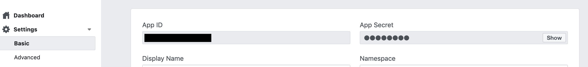
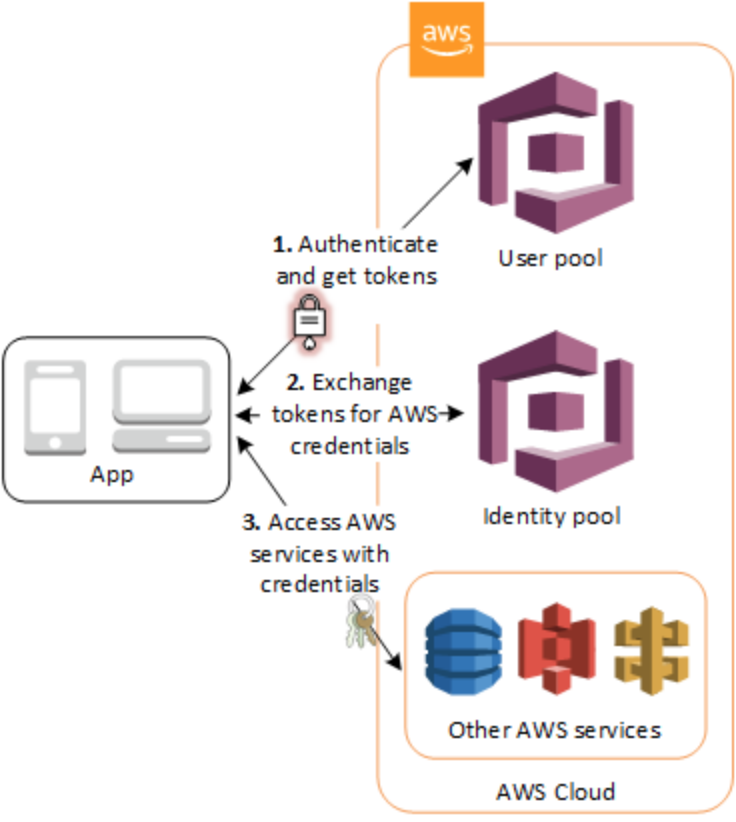
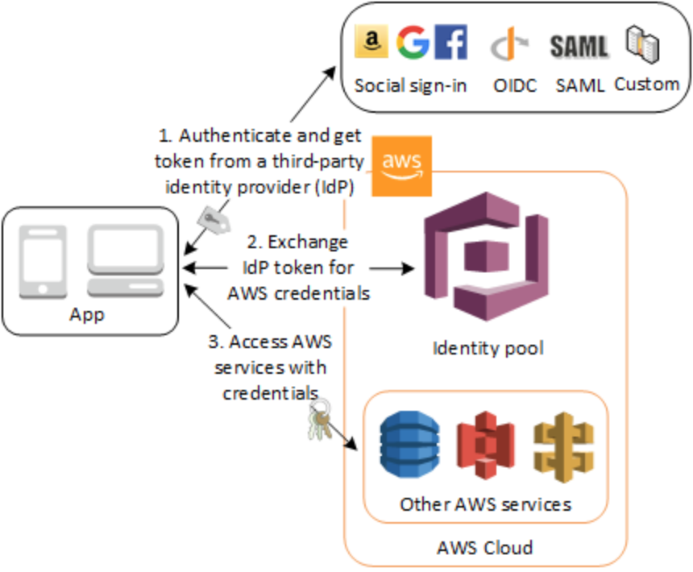
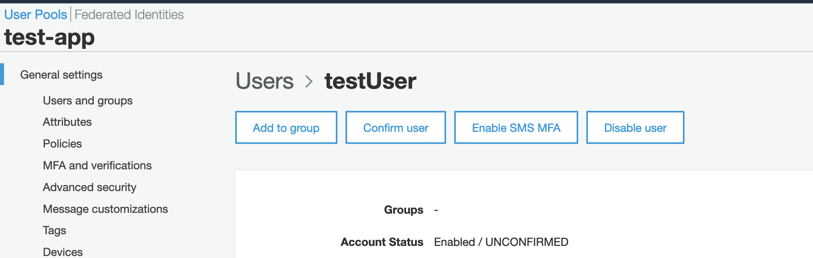

Welcome! Hopefully you didn't have to traverse the interwebs too much to finally stumble on to this tutorial. I stumbled around the interwebs a lot getting AWS Cognito to work. The AWS Cognito docs are notoriously patchy and confusing; information about federated identities are disparate and unclear; and, if you eventually set all that up correctly, it's not crystal clear as to how to do a basic api call! Finally, I got all the pieces working and decided to write this tutorial.

In essence it's about authentication and authorisation using AWS Cognito and Facebook sign-in.

However, along the way you'll also learn how to provision the appropriate infrastructure using Terraform. This will include AWS Cognito user pools and identity pool, API Gateway, and a Lambda function. You'll also learn how to authenticate a request to API Gateway using identity pool for Cognito and Facebook user identities. This sign-up and sign-in process will be done through React with the Amazon Cognito Identity SDK for Javascript. Finally, you'll learn how to make a call to API Gateway through Postman to demonstrate that it is working.

I'll do my best to make this as clear and concise as possible. If there's any confusion let me know and I'll see if I can fix it up. Also, I'm not an expert on all these matters. I just struggled to get all these components working together and figured I'll write up what I learnt in the hope it'll help others who may have been in my situation.

> **WARNING**<br >
> For ease of learning you'll be hardcoding some of your secret keys such as the Facebook key. This is **NOT** best practice. **DO NOT** push any hardcoded secrets to a remote repo. Follow appropriate security practices when using your secret keys in learning, development, and/or production environments.

Alrighty, with all that out of the way, lets get started! It's going to be a bit long, but hopefully not too long!

## Prerequistes

The following are what you need to known before beginning this tute.

- **Terraform** - This isn't a tute about the basics of Terraform so you'll want to have [Terraform installed](https://learn.hashicorp.com/terraform) and know the basics of how to use it.
  - Personally, I use [terraform's docker image](https://hub.docker.com/r/hashicorp/terraform). But for this tute I'm going to assume you've installed Terraform.
- **AWS** - You'll need to have an AWS account. If you don't have one go ahead and [sign-up](https://aws.amazon.com/).
  - **AWS cli** - go [here](https://docs.aws.amazon.com/cli/latest/userguide/cli-chap-install.html) to install it. Then [here](https://docs.aws.amazon.com/cli/latest/userguide/cli-chap-configure.html) to configure it. A credentials file will be created that's used by Terraform to authenticate when provisioning infrastructure. You can also use `brew install awscli`.
  - Personally, I use [aws-vault](https://github.com/99designs/aws-vault) to secure my AWS creds as my secret key won't be stored as plain text on my local computer.
- **Facebook app** - go sign-in to [Facebook developers](https://developers.facebook.com/) and create an app.
  - Get your developer keys from `Settings > Basic`. You'll be needing these later in the tute for a Terraform resource.
  

Before we get into coding I want to explain a bit about AWS Cognito.

## AWS Cognito

When I was first learning how to use AWS Cognito I struggled with understanding the practical difference between user pools and identity pool. This [high level documentation](https://docs.aws.amazon.com/cognito/latest/developerguide/what-is-amazon-cognito.html) gave me an intellectual knowledge about how these pieces worked together, but when it came to correctly implementing them through Terraform I struggled to understand when to appropriately use them.

This is high-level authentication and authorization flow given by AWS for how Cognito works:


The diagram is a bit misleading as it implies that both step 1 and step 2 are necessary for using Cognito. However, they are not. I'll explain the difference and when they are and aren't used.

* Step 1 - *Authenticate* - This is the standard sign-in step required to verify a user's identity.
  1. This step *WILL* be taken if you have provisioned a Cognito user pool as a user management system to sign-in and sign-out users for your app.
  2. This step *WILL* be taken if you have provisioned a Cognito user pool to sign-in and sign-out users for your app using credentials from a third-party identity provider. This is known as federation.
  3. This step *WILL NOT* be taken if you are using a third-party SDK, like the Facebook JS SDK, to sign-in to your app to access AWS resources.

* Step 2. - *Authorization* - This is controlling a user's access to specific AWS resources after they have been authenticated.
  1. This step *WILL* be taken if you have any AWS resources that need to be accessed by any of your users.
  2. This step *WILL NOT* be taken if you don't have any AWS resources that need to be accessed by your users.

This gives Cognito flexibility to be applied to a variety of [use cases](https://docs.aws.amazon.com/cognito/latest/developerguide/cognito-scenarios.html). For example, if you have an app on your own server and want a user management system to augment that (the second use case on the previous link) you'll just have to provision a user pool. This will provide you with the required authentication that will supply you tokens with which you can use to access your resources. In this case identity pool *are not* required.

Have a look at the other 6 use cases AWS provide to get an understanding as to how user pools and identity pools can work together, but *don't have* to work together. At first this wasn't clear to me!

In our situation we'll be implementing [this use case](https://docs.aws.amazon.com/cognito/latest/developerguide/cognito-scenarios.html#scenario-identity-pool). We'll be using Cognito as our user management system as well as a third-party provider (Facebook) to access other AWS services. This means we need to use *both* the user pool and the identity pool. Below is what the auth flow for this looks like.


Now! On to the coding!

Find a suitable directory on your computer. Create a directory for this tute, then create a directory called `terraform`.

## Terraforming AWS infrastructure

To get started on terraforming go to the directory in which you made the `terraform` folder and create a file called `main.tf`. This single file will contain all your Terraform code to provision AWS Cognito, API Gateway, and a basic Lambda function.

Usually, the functionally differennt resources would be grouped and separated into modules so we'd have a module for Cognito, API Gateway, and Lambda. In these modules we'd have a `main.tf` file and we'd separate the variables, and outputs into different files. But in this case we're just going to leave it all in one file.

### Provider

The first thing we need to do for Terraform is to declare which provider we'll be using. We'll be using aws, but there are [plenty of other providers](https://www.terraform.io/docs/providers/index.html) availble to use. We'll also be using an archive provider to zip the lambda file we have created. You can replace the region to whatever [region is closest to you](https://docs.aws.amazon.com/AWSEC2/latest/UserGuide/using-regions-availability-zones.html#concepts-available-regions).

```
provider "aws" {
  region = "ap-southeast-2"
}

provider "archive" {}
```

### Variables

Next, we have a couple of variables. Usually, these are put into their own file called `terraform.tfvars`. Look [here](https://learn.hashicorp.com/terraform/getting-started/variables) for more info about variables. Change the default value in `account_id` to the id of your AWS account you'll be using to provision these resources.

```
variable "region" {
  default = "<insert your closest region>"
}

variable "account_id" {
  default = "<insert you account id here>"
}
```

In your command line run: `terraform init`. This will initialise the providers that you enabled in `main.tf`.

Now, on to building our infrastructure!
<div style="width:75%;height:0;padding-bottom:55%;position:relative;"><iframe src="https://giphy.com/embed/fVeAI9dyD5ssIFyOyM" width="100%" height="100%" style="position:absolute" frameBorder="0" class="giphy-embed" allowFullScreen></iframe></div><p><a href="https://giphy.com/gifs/OctoNation-work-construction-fVeAI9dyD5ssIFyOyM">via GIPHY</a></p>

### Cognito resources

When available I've made a note of where this resource has a reference to an AWS tutorial and inside the resources I've made a note in caps as to what page in the AWS Cognito console the particular key refers. Refering to the AWS Cognito console helped me get a clearer understanding as to what options are available to be provisioned. Most of these keys are not required as Cognito will provide defaults, however, I've put them in to give you an understanding as to what is available to change.

#### User Pool resources

The first resource to provision is a [user pool](https://www.terraform.io/docs/providers/aws/r/cognito_user_pool.html). The AWS tute for this resource is [here]( https://docs.aws.amazon.com/cognito/latest/developerguide/cognito-user-pool-as-user-directory.html). These are the resources that will give us our Cognito user management system.

```
resource "aws_cognito_user_pool" "test_app" {
  # This is choosen when creating a user pool in the console
  name = "test app"

  # ATTRIBUTES
  alias_attributes = ["email", "preferred_username"]

  schema {
    attribute_data_type = "String"
    mutable             = true
    name                = "nickname"
    required            = true
  }

  # POLICY
  password_policy {
    minimum_length    = "8"
    require_lowercase = false
    require_numbers   = false
    require_symbols   = false
    require_uppercase = false
  }

  # MFA & VERIFICATIONS
  mfa_configuration        = "OFF"
  auto_verified_attributes = ["email"]

  # MESSAGE CUSTOMIZATIONS
  verification_message_template {
    default_email_option  = "CONFIRM_WITH_LINK"
    email_message_by_link = "Your life will be dramatically improved by signing up! {##Click Here##}"
    email_subject_by_link = "Welcome to to a new world and life!"
  }
  email_configuration {
    reply_to_email_address = "a-email-for-people-to@reply.to"
  }

  # TAGS
  tags = {
    project = "No Meat May"
  }

  # DEVICES
  device_configuration {
    challenge_required_on_new_device      = true
    device_only_remembered_on_user_prompt = true
  }
}
```

Next we have the `aws_cognito_user_pool_domain`. This used in conjunction with the `CONFIRM_WITH_LINK` option because when a user clicks on the link to confirm their email address they are taken to a page that will indicate the successful confirmation.

> NOTE<br />
> Make sure the domain name is a unique value which is why we are adding a random number to the end.

```
# DOMAIN NAME
resource "aws_cognito_user_pool_domain" "test_app" {
  user_pool_id = "${aws_cognito_user_pool.test_app.id}"
  # DOMAIN PREFIX
  domain = "test-app-<add random number on the end>"
}
```

Then we have `aws_cognito_user_pool_client` which is used to create the id, amongst other client related settings, that will be used to configure the Amazon Cognito Identity SDK for Javascript which we'll be using through React. Go [here](https://docs.aws.amazon.com/cognito/latest/developerguide/cognito-user-pools-configuring-app-integration.html) for a AWS tute to get more information about this.

```
resource "aws_cognito_user_pool_client" "test_app" {
  user_pool_id = "${aws_cognito_user_pool.test_app.id}"

  # APP CLIENTS
  name                   = "test-app-client"
  refresh_token_validity = 30
  read_attributes  = ["nickname"]
  write_attributes = ["nickname"]

  # APP INTEGRATION -
  # APP CLIENT SETTINGS
  supported_identity_providers = ["COGNITO"]
  callback_urls                = ["http://localhost:3000"]
  logout_urls                  = ["http://localhost:3000"]
}
```

> **NOTE**<br />
> The key `supported_identity_providers` can take other values to indicate we want to use third-party credentials. This would be something like "Facebook", "Google", etc. It easier to get these values from the `aws_cognito_identity_provider` resource which also helps prevent race conditions between resources. However, we'd only need to do that if we were integrating third-party identity providers such as Facebook, Google, etc into a Cognito user pool in order to sign-in to our app using the credentials for these third-part providers. Like in [this use case](https://docs.aws.amazon.com/cognito/latest/developerguide/cognito-scenarios.html#scenario-basic-user-pool).

If you want to have a crack at provisioning all these resources go right ahead. Just run the following commands:

`terraform plan --out=test-app.plan`

This will show you what Terraform will be creating and produce `.plan` file. To provision the resources do:

`terraform apply`

This will tell you what it'll be creating and ask you to approve. Type `yes`, hit enter, and away it goes. You should see a successful provisioning of all the resources! The apply step will also create a `terraform.tfstate` file that shows you the current situation with the resources you have provisioned. You can look at this file, but it isn't recommended to alter it as it'll mess up the resources you've provision and you may have to go into the console to manually destroy them.

You've just created you first user pool (or maybe not if you've done this before)! Yay! Congrats! This gives you a Cognito user management system where users can sign-up and sign-in. This can be used in conjunction with your own app where there aren't any other AWS resources that users need to access (or if your API Gateway authorization is Cognitio, but I'll explain that later). But that's it!

Let's move onto provisioning an identity pool so we can get access to our API Gateway through our Facebook third-party identity provider and also with the Cognito user pool we just created.

#### Identity Pool resources

This resource is the page you land on when you create an identity pool in the Cognito console. It lets the identity pool know what authentication providers you want to give access to AWS resources.

You don't have to add the Cognito identity provider to this resource if you don't want/need your cognito users to have access to any AWS services and/or you only want users using the Facebook identity provider to have access to your AWS resources.

In this case I'm giving my Cognito provider and my Facebook provider access to my AWS resources. The value for `graph.facebook.com` is your Facebook App ID that you would've gotten when you created your Facebook App.

```
resource "aws_cognito_identity_pool" "test_app_id_pool" {
  identity_pool_name               = "test app"
  allow_unauthenticated_identities = false
  cognito_identity_providers {
    client_id               = aws_cognito_user_pool_client.test_app.id
    provider_name           = aws_cognito_user_pool.test_app.endpoint
    server_side_token_check = false
  }

  supported_login_providers = {
    "graph.facebook.com" = "<your App ID goes here. Refer to picture at the top>"
  }
}
```

Next we have a resource that is used to attach roles to this identity pool. These roles and the attached policies will give your users the permission to access API Gateway. This is the second step in the identity pool creation process if you were doing it in the console.

The identity pool needs an authenticated and unauthenticated role. Try to limit the amount of access you give to either of these roles to the minimum required amount. In this case we'll give our authenticated users the ability to invoke an API Gateway endpoint. While the unauthenticated role will deny every action on every resource.

There a few different ways to create policy documents with Terraform, [the recommended](https://www.terraform.io/docs/providers/aws/guides/iam-policy-documents.html#aws_iam_policy_document-data-source) way is using a `aws_iam_policy_document` data source. That policy will be attached to a role via the `aws_iam_role_policy` resource while the role is created with the `aws_iam_role` resource. A role needs to know what resources can use, otherwise known as assume.

In our case we can see the `assume_role_policy` attribute in the `aws_iam_role_policy` resource is giving premission for our user, through our cognito identity pool, the right to assume the `api_gateway_access` role. Attached to that is the permission to take the action to invoke our API Gateway. We are then attaching that role to the `authenticated` attribute of our identity pool. This is used for authenticated users, when they sign-in via any of the providers associated with the identity pool. In our case a Cognito user pool and Facebook third-party provider.

```
resource "aws_cognito_identity_pool_roles_attachment" "test_app_id_roles" {
  identity_pool_id = aws_cognito_identity_pool.test_app_id_pool.id

  roles = {
    "authenticated"   = aws_iam_role.api_gateway_access.arn
    "unauthenticated" = aws_iam_role.deny_everything.arn
  }
}

resource "aws_iam_role_policy" "api_gateway_access" {
  name   = "api-gateway-access"
  role   = aws_iam_role.api_gateway_access.id
  policy = data.aws_iam_policy_document.api_gateway_access.json
}

resource "aws_iam_role" "api_gateway_access" {
  name = "ap-gateway-access"

  assume_role_policy = <<EOF
{
  "Version": "2012-10-17",
  "Statement": [
    {
      "Effect": "Allow",
      "Principal": {
        "Federated": "cognito-identity.amazonaws.com"
      },
      "Action": "sts:AssumeRoleWithWebIdentity",
      "Condition": {
        "StringEquals": {
          "cognito-identity.amazonaws.com:aud": "${aws_cognito_identity_pool.test_app_id_pool.id}"
        },
        "ForAnyValue:StringLike": {
          "cognito-identity.amazonaws.com:amr": "authenticated"
        }
      }
    }
  ]
}
EOF
}

data "aws_iam_policy_document" "api_gateway_access" {
  version = "2012-10-17"
  statement {
    actions = [
      "execute-api:Invoke"
    ]

    effect = "Allow"

    resources = ["arn:aws:execute-api:*:*:*"]
  }
}

resource "aws_iam_role_policy" "deny_everything" {
  name   = "deny_everything"
  role   = aws_iam_role.deny_everything.id
  policy = data.aws_iam_policy_document.deny_everything.json
}

resource "aws_iam_role" "deny_everything" {
  name = "deny_everything"
  # This will grant the role the ability for cognito identity to assume it
  assume_role_policy = <<EOF
{
  "Version": "2012-10-17",
  "Statement": [
    {
      "Effect": "Allow",
      "Principal": {
        "Federated": "cognito-identity.amazonaws.com"
      },
      "Action": "sts:AssumeRoleWithWebIdentity",
      "Condition": {
        "StringEquals": {
          "cognito-identity.amazonaws.com:aud": "${aws_cognito_identity_pool.test_app_id_pool.id}"
        },
        "ForAnyValue:StringLike": {
          "cognito-identity.amazonaws.com:amr": "unauthenticated"
        }
      }
    }
  ]
}
EOF
}

data "aws_iam_policy_document" "deny_everything" {
  version = "2012-10-17"

  statement {
    actions = ["*"]
    effect    = "Deny"
    resources = ["*"]
  }
}
```

That's it for the Identity Pool resources. If you want you can do a plan and apply and see what it looks like in the console.

### API Gateway resources

This is a pretty straight forward setup of an API Gateway. I won't go into explaining all of this except for a brief comment on the `authorization` attribute in `aws_api_gateway_method`. There are [4 options to choose](https://www.terraform.io/docs/providers/aws/r/api_gateway_method.html#authorization) for this attribute. If you want to *only* use a Cognito user pool to authorize an API Gateway you can choose the `COGNITO_USER_POOLS` option. If you choose this option you'll also have to provision the `aws_api_gateway_authorizer` resource which will connect your user pool/s to an API Gateway.

What would happen is when a sign-in occurs with a user from an associated user pool the sign-in will return an `idToken`. To invoke the API Gateway this token would be put into the `Authorization` header and giving the user authority to call this API Gateway resource. *This is not how an identity pool authorises a user*. This tripped me up when I first started learning to use Cognito.

We will not be using user pools to authorise the invocation of the API Gateway. You'll see that our `authorization` attribute is set to `AWS_IAM`. *This* is how an identity pool authorises the invocation of an API Gateway. The identity pool is using the roles that we setup in the previous section of the tute to invoke the correct permissions through AWS's IAM system which is why the value for this is set to `AWS_IAM`.

This also means the token system is a bit different. I'll explain that later when we start to invoke the API Gateway.

```
resource "aws_api_gateway_rest_api" "example_api" {
  name        = "Secure API Gateway"
  description = "Example Rest Api"
}

resource "aws_api_gateway_resource" "example_api_resource" {
  rest_api_id = "${aws_api_gateway_rest_api.example_api.id}"
  parent_id   = "${aws_api_gateway_rest_api.example_api.root_resource_id}"
  path_part   = "test"
}

resource "aws_api_gateway_method" "example_api_method" {
  rest_api_id   = "${aws_api_gateway_rest_api.example_api.id}"
  resource_id   = "${aws_api_gateway_resource.example_api_resource.id}"
  http_method   = "POST"
  authorization = "AWS_IAM"

  request_parameters = {
    "method.request.path.proxy" = true
  }
}

resource "aws_api_gateway_integration" "example_api_method-integration" {
  rest_api_id             = "${aws_api_gateway_rest_api.example_api.id}"
  resource_id             = "${aws_api_gateway_resource.example_api_resource.id}"
  http_method             = "${aws_api_gateway_method.example_api_method.http_method}"
  type                    = "AWS_PROXY"
  uri                     = "arn:aws:apigateway:${var.region}:lambda:path/2015-03-31/functions/arn:aws:lambda:${var.region}:${var.account_id}:function:${aws_lambda_function.example_test_function.function_name}/invocations"
  integration_http_method = "POST"
}

resource "aws_api_gateway_deployment" "example_deployment_dev" {
  depends_on = [
    "aws_api_gateway_method.example_api_method",
    "aws_api_gateway_integration.example_api_method-integration"
  ]
  rest_api_id = "${aws_api_gateway_rest_api.example_api.id}"
  stage_name  = "dev"
}
```

### Lambda resources

This is a pretty straight forward setup for a example lambda function. I won't explain it here, you'll be able to find plenty of tutorials about it if you want to learn more.

```
data "archive_file" "lambda" {
  type        = "zip"
  source_dir  = "./testLambda"
  output_path = "lambda.zip"
}

resource "aws_lambda_function" "example_test_function" {
  filename         = "${data.archive_file.lambda.output_path}"
  function_name    = "example_test_function"
  role             = "${aws_iam_role.example_api_role.arn}"
  handler          = "index.handler"
  runtime          = "nodejs10.x"
  source_code_hash = "${filebase64sha256("${data.archive_file.lambda.output_path}")}"
  publish          = true
}

resource "aws_iam_role" "example_api_role" {
  name               = "example_api_role"
  assume_role_policy = data.aws_iam_policy_document.lambda_assume_role_policy.json
}

data "aws_iam_policy_document" "lambda_assume_role_policy" {
  version = "2012-10-17"
  # ASSUME ROLE
  statement {
    actions = [
      "sts:AssumeRole",
    ]

    effect = "Allow"

    principals {
      type = "Service"
      identifiers = ["lambda.amazonaws.com"]
    }
  }
}

resource "aws_lambda_permission" "apigw_lambda" {
  statement_id  = "AllowExecutionFromAPIGateway"
  action        = "lambda:InvokeFunction"
  function_name = "${aws_lambda_function.example_test_function.function_name}"
  principal     = "apigateway.amazonaws.com"

  # More: http://docs.aws.amazon.com/apigateway/latest/developerguide/api-gateway-control-access-using-iam-policies-to-invoke-api.html
  source_arn = "arn:aws:execute-api:${var.region}:${var.account_id}:${aws_api_gateway_rest_api.example_api.id}/*/${aws_api_gateway_method.example_api_method.http_method}${aws_api_gateway_resource.example_api_resource.path}"
}
```

Create a folder in your `terraform` directory called `testLambda`, create a file inside that called `index.js`, and copy the following bit of node code into it.

```
exports.handler = function(event, context, callback) {
  callback(null, {
    statusCode: '200',
    body: JSON.stringify({ 'message': 'hello world' }),
    headers: {
      'Content-Type': 'application/json',
    },
  });
};
```

This is a simple function to return a message to show the API call worked.

### Outputs

There's just one final piece: outputs! This will give you the values that you need to config your client and can also give you other useful values. We only need the following four values to setup our React client.

```
output "user_pool_id" {
  value = aws_cognito_user_pool.test_app.id
}

output "user_pool_client_id" {
  value = aws_cognito_user_pool_client.test_app.id
}

output "identity_pool_id" {
  value = aws_cognito_identity_pool.test_app_id_pool.id
}

output "test_app_url" {
  value = "https://${aws_api_gateway_deployment.example_deployment_dev.rest_api_id}.execute-api.${var.region}.amazonaws.com/${aws_api_gateway_deployment.example_deployment_dev.stage_name}"
}
```

Now run `terraform plan --out=test-app.plan` and `terraform apply` (fingers, crossed) to provision these resources and get the required outputs.

<div style="width:75%;height:0;padding-bottom:55%;position:relative;"><iframe src="https://giphy.com/embed/3oD3Yim3WtrDBPIXM4" width="100%" height="100%" style="position:absolute" frameBorder="0" class="giphy-embed" allowFullScreen></iframe></div><p><a href="https://giphy.com/gifs/studiosoriginals-3oD3Yim3WtrDBPIXM4">via GIPHY</a></p>

Congrats! You have just successfully provision all the resources that you need to use Cognito and Facebook as identity providers. Nice work, but... now what? Well as the old saying goes, if you build it they will come.

In this case "they" is you with a React client to sign-in as a Cognito and Facebook user. Let's get client sided!

## React Cognito client

Go into your tute folder, one level up to the `terraform` folder we were just working in and run the following:

`npx create-react-app test-app`
`cd test-app`
`npm install amazon-cognito-identity-js`
`npm install aws-sdk`
`npm install react-facebook-login`
`npm install formik`
`npm run start`

Before we move on I'll make a few points about what we are installing. Y'all probably know about `create-react-app` already, so I won't go into that. If you haven't do a search and you'll find plenty of info.

The next package, `amazon-cognito-identity-js`, is the client we'll be using to interface with our Cognito service. However, it isn't the only way to do this. You can also use the [AWS Amplify Authentication](https://aws-amplify.github.io/docs/js/authentication) module of the Amplify framework. I'm not 100% sure what is required to use this as I skimmed their docs. But it may be worth learning as it seems to streamline a bunch of config and helps get this stuff set-up faster. However, Amplify Authentication is using `amazon-cognito-identity-js` under the hood anyway.

We'll be installing the AWS SDK for JavaScript to get access to the [CognitoIdentityCredentials class](https://docs.aws.amazon.com/AWSJavaScriptSDK/latest/AWS/CognitoIdentityCredentials.html). We need this to retrieve credentials from the identity pool that will be used to access the API Gateway. I don't really understand why this wasn't integrated into the `amazon-cognito-identity-js` package.

This SDK also contains the [CognitoIdentity class](https://docs.aws.amazon.com/AWSJavaScriptSDK/latest/AWS/CognitoIdentity.html) and [CognitoIdentityServiceProvider class](https://docs.aws.amazon.com/AWSJavaScriptSDK/latest/AWS/CognitoIdentityServiceProvider.html). It seems these two classes can be used in the React client, but I got the feeling it'd be mainly used for server side for when a user is created with the [AdminCreateUser API](https://docs.aws.amazon.com/cognito/latest/developerguide/using-amazon-cognito-identity-user-pools-javascript-example-authenticating-admin-created-user.html). I never looked too deeply into it because the recommended client implementation is through the [Amazon Cognito Identity SDK for JavaScript](https://github.com/aws-amplify/amplify-js/tree/master/packages/amazon-cognito-identity-js).

Then we have `react-facebook-login`. This gives us a sign-in button component to use. It takes the hassle out of setting up the [Facebook JavaScript SDK](https://developers.facebook.com/docs/javascript) in React.

The final piece is `formik` a simple and easy [form helper](https://jaredpalmer.com/formik/docs/overview).

Finally, we start the React server!

### Cognito client config

In the `src` folder of your React project create a file called `cognitoConfig.js`. This will contain all the necessary configuration details that we'll be exporting to use elsewhere.

This is where you'll place the appropriate values from the relevant outputs of the `terraform apply` process.

```
import { CognitoUserPool } from 'amazon-cognito-identity-js';
import AWS from 'aws-sdk';

export const USER_POOL_ID = '<user_pool_id>'
export const CLIENT_ID = '<user_pool_client_id>'


AWS.config.update({
  region: '<your closest region>'
})


const poolData = {
  UserPoolId: USER_POOL_ID,
  ClientId: CLIENT_ID
}

const cognito = new CognitoUserPool(poolData);

export const IDENTITY_POOL_ID = '<identity_pool_id>'

export const USER_POOL_URL = `cognito-idp.ap-southeast-2.amazonaws.com/${USER_POOL_ID}`
export default cognito;
```

### React SignUp form

Next create a file in `src` folder called `SignUp.js` and copy the following bit of code. This will be a form allowing a user to sign-up to our Cognito service. Their details will be stored in the user pool resource that we provisioned earlier.

```
import React from "react";
import { CognitoUserAttribute } from "amazon-cognito-identity-js";
import { Formik } from "formik";
import cognito from "../cognitoConfig";

const SignUp = () => (
  <div>
    <Formik
      initialValues={{ username: "", password: "", nickname: "" }}
      onSubmit={(values, { setSubmitting }) => {
        const cognitoData = [];

        cognitoData.push(new CognitoUserAttribute({
          Name: 'nickname',
          Value: values.nickname
        }));

        cognito.signUp(values.username, values.password, cognitoData, null, function(err, result){
          if (err) {
              console.log('error', err);
              return;
          }
          var cognitoUser = result.user;
          console.log('User name is ' + cognitoUser.getUsername());
      });
      // A way to set the isSubmitting function in Formik
      // https://jaredpalmer.com/formik/docs/api/formik#issubmitting-boolean
        setSubmitting(false);
      }}
    >
      {({
        values,
        errors,
        touched,
        handleChange,
        handleBlur,
        handleSubmit,
        isSubmitting
        /* and other goodies */
      }) => (
        <form onSubmit={handleSubmit}>
          <label>
            Username
            <input
              type="text"
              name="username"
              onChange={handleChange}
              onBlur={handleBlur}
              value={values.username}
            />
            {errors.username && touched.username && errors.username}
          </label>
          <label>
            Password
            <input
              type="password"
              name="password"
              onChange={handleChange}
              onBlur={handleBlur}
              value={values.password}
            />
            {errors.password && touched.password && errors.password}
          </label>
          <label>
            Nickname
            <input
              type="text"
              name="nickname"
              onChange={handleChange}
              onBlur={handleBlur}
              value={values.nickname}
            />
            {errors.nickname && touched.nickname && errors.nickname}
          </label>
          <button type="submit" disabled={isSubmitting}>
            Submit
          </button>
        </form>
      )}
    </Formik>
  </div>
);

export default SignUp;
```

Now import it into `App.js` by adding `import SignUp from './SignUp';` and use the `<SignUp />` component just under the end anchor tag (`</a>`) after `Learn React`.

With your React server running head to `localhost:3000` which will open for you once you start the server. Open up your console and go ahead to sign-up yourself as a user.

If everything goes according to plan your console will return to you the name of the user you created. You have to confirm your user before you can sign-in with it. This usually would be done with an email, but you can do it manually. Sign-in to your AWS account, navigate to Cognito, and confirm your user. The picture below shows the console page you go to.



### React SignIn form

Now lets create the SignIn form so your user can be authenticated and get some tokens from identity pool with which to invoke the API Gateway.

In this form my reference for the `onSubmit` function was Use case 4. in the [package documentation](https://github.com/aws-amplify/amplify-js/blob/6c81ca5127c3dff924c28e86ff66db1ff6dac89b/packages/amazon-cognito-identity-js/README.md).

```
import React from "react";
import AWS from 'aws-sdk';
import { CognitoUser, AuthenticationDetails } from "amazon-cognito-identity-js";
import { Formik } from "formik";
import cognito, { USER_POOL_URL, IDENTITY_POOL_ID } from "./cognitoConfig";

const SignIn = () => (
  <div>
    <Formik
      initialValues={{ username: "", password: "" }}
      onSubmit={(values, { setSubmitting }) => {
        const userPool = {
          Username: values.username,
          Pool: cognito
        }
        const formValues = {
          Username: values.username,
          Password: values.password
        }

        const authenticationDetails = new AuthenticationDetails(formValues);

        const cognitoUser = new CognitoUser(userPool);

        cognitoUser.authenticateUser(authenticationDetails, {
          onSuccess: result => {
            const idToken = result.getIdToken().getJwtToken();

            const loginsObj = {
              [USER_POOL_URL]: idToken
            }

            console.log('ID TOKEN', idToken);

            AWS.config.credentials = new AWS.CognitoIdentityCredentials({
              IdentityPoolId : IDENTITY_POOL_ID,
              Logins : loginsObj
            })
            AWS.config.credentials.refresh((error) => {
              if (error) {
                   console.error('this is the error', error);
              } else {
                const accessKeyId = AWS.config.credentials.accessKeyId;
                const secretAccessKey = AWS.config.credentials.secretAccessKey;
                const sessionToken = AWS.config.credentials.sessionToken;
                console.log('accessKey', accessKeyId);
                console.log('secretKey', secretAccessKey);
                console.log('sessionToken', sessionToken);

                console.log('Successfully logged!');
              }
          });

          },
          onFailure: err => {
            console.log(`This is the error ${err}`);
          }
        });
        setSubmitting(false);
      }}
    >
      {({
        values,
        errors,
        touched,
        handleChange,
        handleBlur,
        handleSubmit,
        isSubmitting
        /* and other goodies */
      }) => (
        <form onSubmit={handleSubmit}>
          <label>
            username
            <input
              type="text"
              name="username"
              onChange={handleChange}
              onBlur={handleBlur}
              value={values.username}
            />
            {errors.username && touched.username && errors.username}
          </label>
          <label>
            Password
            <input
              type="password"
              name="password"
              onChange={handleChange}
              onBlur={handleBlur}
              value={values.password}
            />
            {errors.password && touched.password && errors.password}
          </label>
          <button type="submit" disabled={isSubmitting}>
            Submit
          </button>
        </form>
      )}
    </Formik>
  </div>
)

export default SignIn;
```

Now, if you just wanted to sign-in to Cognito and use the `aws_api_gateway_authorizer` to authorise access to API Gateway you wouldn't need to do any of the `AWS.config.credentials` steps. You can just get the `idToken`, put it in the `Authorization` header, and make a call to an API Gateway and be given access. However, we are not doing that.

Lets have a look at what we are doing instead.

### API Gateway call via Postman

This was another part of the process that confused me. When I first started learning Cognito I was invoking API Gateway with just the `idToken`, not realising there was another method, used for identity pool configuration, to invoke API Gateway. I stumbled onto [this AWS documentation](https://docs.aws.amazon.com/apigateway/latest/developerguide/how-to-use-postman-to-call-api.html) about invoking an API in Postman and it cleared everything up. This is the method we'll be using to invoke API Gateway.

If you don't already have it, go [download Postman](https://www.getpostman.com/downloads/), open it up, and create a new request. Give it a name, put it in a folder, and navigate to the `Authorization` header. In the dropdown menu select `AWS Signature`.

If you haven't already go sign-in, and open up your console. You'll see a bunch of different tokens pop-up. The first is the `idToken` which I mentioned above. It won't be used here. The next three tokens will be used.

Copy the `accessKey` token and paste it into the `AccessKey` form field in Postman Authorization section. Copy the `secretKey` and `sessionToken` then paste them in the appropriate places in the Authorization section. Enter your region and in the `Service Name` form field add `execute-api`. Once all this is filled in press `Preview Request`. This will fill in your headers. Copy the `test_app_url` into the `Enter request URL` form field and change the method request to `POST`. Then press `Send`.

If everything worked out successfully you'll get a message that says "hello world"! Yay! Congrats. But we are not done yet, we've got to get a third-party identity provider in the mix. Let's move onto implementing the Facebook sign-in.

### Facebook sign-in

Create a file in `src` folder called `FacebookSignIn.js` and paste the following code inside. Before you save make sure you update `appId` to your Facebook developer App ID that you got when you created the new app through Facebook. Otherwise, it'll fail.

You can probably see there is less going on in this bit of code than in the Cognito version. The Cognito sign-in had to use `authenticateUser()` to verify the user through the Cognito user pool. This way, however, is verifying the users through the third-party provider of Facebook. This means we are signing into Facebook which returns an accessToken used to call `CognitoIdentityCredentials()`. This will test whether Facebook users are allowed to be given authorisation and to what AWS resources they're authorised to use. If they have permission it'll send back the appropriate tokens which we will then use, like with the Cognito user, to gain access to the API Gateway.

```
import React from 'react';
import AWS from 'aws-sdk';
import FacebookSignIn from 'react-facebook-login';
import { IDENTITY_POOL_ID } from "./cognitoConfig";


const responseFacebook = (response) => {
  if (response) {
    AWS.config.credentials = new AWS.CognitoIdentityCredentials({
      IdentityPoolId: IDENTITY_POOL_ID,
      Logins: {
         'graph.facebook.com': response.accessToken
      }
      })

    AWS.config.credentials.get((error) => {
      if (error) {
           console.error('this is the error', error);
      } else {
        const accessKeyId = AWS.config.credentials.accessKeyId;
        const secretAccessKey = AWS.config.credentials.secretAccessKey;
        const sessionToken = AWS.config.credentials.sessionToken;

        console.log('secretAccessKey', secretAccessKey);
        console.log('accessKeyId!', accessKeyId);
        console.log('sessionToken', sessionToken);

        console.log('You are now logged in.');
      }
    });
  } else {
    console.log('There was a problem logging you in.');
  }
}

const FacebookSignInComponent = () => (
  <div>
    <FacebookSignIn
        appId="<App ID>"
        autoLoad={true}
        fields="name,email,picture"
        callback={responseFacebook}
      />
  </div>
)

export default FacebookSignInComponent;
```

Now sign-in to Facebook then copy and paste the credentials into the correct spots like you did with the Cognito user previously.

## Finito

Well, this is the end. Don't be sad. You can go through it again if you want!

I hope this tute helped give you a clearer working understanding of AWS Cognito user pools and identity pools and the different use cases for each, or both, of them. I also hope you learnt how to implement this in Terraform and that you can customise the resources to your own specifications.

Before I sign off I just want to mention the code snippits here weren't designed to be used in production, but a starting point for y'all to implement your own solution in production.

One final note, remember to run `terraform destroy` to remove all the resources that you provisioned. You don't want to be shocked by an unsuspecting bill for resources that you have hanging around.

<div style="width:75%;height:0;padding-bottom:45%;position:relative;"><iframe src="https://giphy.com/embed/l0HUgf74ViHep8gCY" width="100%" height="100%" style="position:absolute" frameBorder="0" class="giphy-embed" allowFullScreen></iframe></div><p><a href="https://giphy.com/gifs/explosion-building-push-l0HUgf74ViHep8gCY">via GIPHY</a></p>

If you have any questions, comments, suggestions, etc feel free to drop me a line on Twitter or my email.

